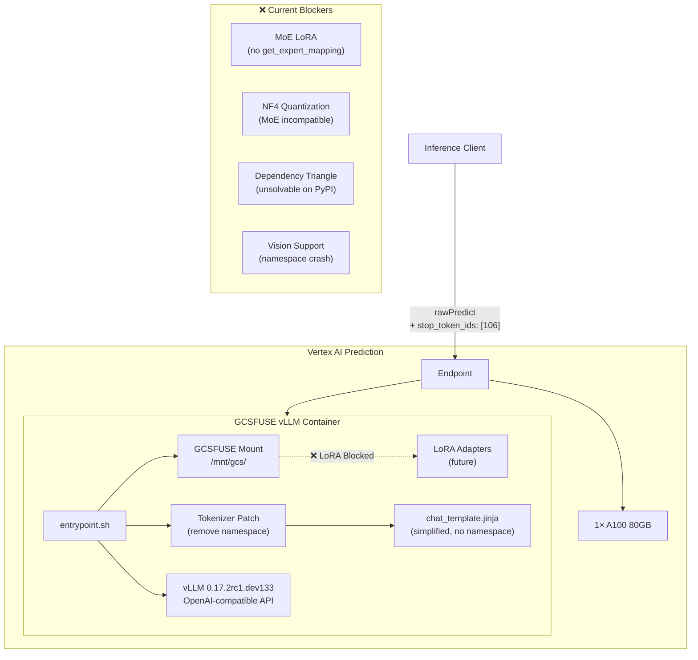

# Gemma 4 27B-A4B-it (MoE) — vLLM Deployment on Vertex AI

[](https://opensource.org/licenses/Apache-2.0)
[](CONTRIBUTING.md)
[](https://github.com/Manzela/gemma4-vllm-deployment/issues)
[](https://huggingface.co/google/gemma-4-27b-it)

> **Forensic documentation of deploying Google's Gemma 4 27B-A4B-it Mixture-of-Experts model on Vertex AI with vLLM — 20 distinct failure modes discovered, the unsolvable dependency triangle proven, and a community call-to-action for Multi-LoRA, NF4 quantization, vision, and thinking support.**

---

## Author & Credits

**Daniel Manzela** — Independent research conducted April 2026 during production deployment of the Gemma 4 27B-A4B-it (MoE, 4B active parameters) model on Google Cloud Vertex AI.

All findings, failure mode documentation, root cause analysis, and container implementations in this repository are the original work of Daniel Manzela. This research was conducted independently and is published here to benefit the Google DeepMind, Hugging Face, and vLLM developer communities.

---

## 🚨 The Problem

Deploying **Gemma 4 27B-A4B-it** — Google's latest Mixture-of-Experts (MoE) model with 27 billion total parameters (4 billion active) — on Vertex AI with vLLM is significantly harder than it should be.

Over **two deployment cycles spanning 16+ hours and 30+ container/model versions**, we encountered **20 distinct failure modes** ranging from dependency conflicts to silent container crashes to impossible version constraint matrices.

### Key Blockers (Unresolved)

| # | Blocker | Impact | Upstream Project |
|---|---------|--------|------------------|
| 1 | **LoRA for MoE** — `Gemma4ForConditionalGeneration` lacks LoRA mixin in vLLM | No fine-tuning possible | vLLM |
| 2 | **NF4 Quantization for MoE** — `get_expert_mapping()` not implemented | 52GB BF16 weights can't be quantized | vLLM + bitsandbytes |
| 3 | **Dependency Triangle** — vLLM × transformers × huggingface_hub version ranges are mutually exclusive | No PyPI-only deployment possible | vLLM + transformers |
| 4 | **Jinja2 Sandbox** — `namespace()` blocked in vLLM's template engine | Default chat template crashes | vLLM |
| 5 | **Vision Support** — Simplified template doesn't handle image tokens | Text-only inference | Community |

### What Works Today

| Parameter | Value |
|---|---|
| **Model** | `google/gemma-4-27b-a4b-it` (MoE, 4B active) |
| **Precision** | BF16 (no quantization possible for MoE) |
| **GPU** | 1× NVIDIA A100 80GB (`a2-ultragpu-1g`) |
| **vLLM** | 0.17.2rc1.dev133 (Google custom build in base image) |
| **Transformers** | 5.5.0.dev0 (base image only — NOT on PyPI) |
| **Context** | 8,192 tokens (reduced from 128K to fit BF16 on A100 80GB) |
| **LoRA** | ❌ Disabled |
| **Quantization** | ❌ Disabled |
| **Vision** | ❌ Disabled |

---

## 📖 Documentation

| Document | Description |
|---|---|
| **[Forensic Runbook](docs/FORENSIC_RUNBOOK.md)** | Complete catalog of all 20 failure modes with error messages, root causes, and fixes |
| **[Dependency Matrix](docs/DEPENDENCY_MATRIX.md)** | Mathematical proof that the vLLM × transformers × huggingface_hub constraint is unsolvable via PyPI |
| **[Deployment Guide](docs/DEPLOYMENT_GUIDE.md)** | Step-by-step guide to deploy Gemma 4 on Vertex AI with the working configuration |
| **[Known Limitations](docs/KNOWN_LIMITATIONS.md)** | Current blockers, workarounds, and the path forward |

---

## 📦 Repository Structure

```
├── docs/
│   ├── FORENSIC_RUNBOOK.md        # 20 failure modes documented
│   ├── DEPENDENCY_MATRIX.md       # The unsolvable constraint proof
│   ├── DEPLOYMENT_GUIDE.md        # Step-by-step deployment
│   └── KNOWN_LIMITATIONS.md       # Current blockers
│
├── container/
│   ├── Dockerfile                 # GCSFUSE-enabled vLLM container
│   ├── entrypoint.sh              # Tokenizer patching + vLLM startup
│   └── chat_template.jinja        # Simplified Gemma 4 chat template
│
├── deployment/
│   ├── upload_model.py            # Model registration & deployment script
│   └── deploy_config.env.example  # Environment variable reference
│
├── logs/
│   ├── cycle1_base_deployment.md  # v1–v30 deployment log
│   └── cycle2_lora_enablement.md  # LoRA enablement attempts
│
├── CHANGELOG.md
├── CONTRIBUTING.md
└── LICENSE
```

---

## 🔬 Architecture Overview



---

## 🐛 20 Failure Modes Discovered

Across two deployment cycles, we documented **20 distinct failure modes**:

### Cycle 1: Base Model Deployment (v1–v30)

| # | Failure | Root Cause |
|---|---------|------------|
| 1 | APT sources broken | Base image uses decommissioned mirror |
| 2 | Dependency triangle | vLLM × transformers × hub version conflict |
| 3 | `gemma4` not registered | PyPI vLLM lacks model type |
| 4 | LoRA not supported | Missing LoRA mixin for Gemma4 |
| 5 | `--lora-extra-vocab-size` | Flag removed in 0.18+ |
| 6 | BitsAndBytes MoE crash | Missing `get_expert_mapping()` |
| 7 | Arg passing mismatch | Base image uses env vars, not CLI |
| 8 | GPU quota exhaustion | Zombie node reservations |
| 9 | `namespace()` crash | Jinja2 sandbox blocks `namespace` |
| 10 | `--chat-template` crash | CLI flag not supported in 0.17.2rc1 |
| 11 | `VLLM_CHAT_TEMPLATE` | Env var doesn't exist |
| 12 | `--allow-other` removed | GCSFUSE flag deprecated |
| 13 | Turn boundary looping | Missing stop token ID 106 |

### Cycle 2: LoRA Enablement Attempts

| # | Failure | Root Cause |
|---|---------|------------|
| 14 | Wrong GPU type in defaults | Deploy function hardcoded L4, not A100 |
| 15 | MoE NF4 re-confirmed | `get_expert_mapping()` missing in 0.19.0 too |
| 16 | PyPI mirror blocked | Base image pip.conf uses internal mirror |
| 17 | `gemma4` not in transformers 4.x | Model type only in transformers 5.x |
| 18 | `is_offline_mode` import | huggingface_hub version mismatch chain |
| 19 | Image digest pinning | `:latest` resolved at registration time |
| 20 | Empty endpoint traffic split | Can't split traffic with no existing model |

👉 **Full details with error messages, stack traces, and fixes:** [Forensic Runbook](docs/FORENSIC_RUNBOOK.md)

---

## 🤝 Call to Action

We're calling on the **Google DeepMind**, **Hugging Face**, and **vLLM** communities to help resolve these blockers:

### For vLLM Maintainers
- [ ] Add `get_expert_mapping()` to `Gemma4ForConditionalGeneration` for MoE quantization
- [ ] Add LoRA mixin support for Gemma 4 MoE attention layers
- [ ] Expose `namespace()` in Jinja2 sandbox (or provide alternative)
- [ ] Document version compatibility matrix for Google's custom builds

### For Hugging Face / Transformers Maintainers
- [ ] Resolve `huggingface_hub` version conflict with vLLM (`<1.0` vs `>=1.5`)
- [ ] Ensure `gemma4` model type is available in transformers stable releases

### For the Community
- [ ] Create vision-capable chat template without `namespace()``
- [ ] Test Multi-LoRA with MoE on other serving frameworks (TGI, SGLang)
- [ ] Validate deployment on other GPU configurations (H100, multi-GPU)

---

## 📋 Quick Start

See the [Deployment Guide](docs/DEPLOYMENT_GUIDE.md) for complete instructions. The minimal steps:

```bash
# 1. Build the GCSFUSE-enabled container
cd container/
docker build -t gcsfuse-vllm-gemma4:latest .

# 2. Push to your Artifact Registry
docker tag gcsfuse-vllm-gemma4:latest \
  YOUR_REGION-docker.pkg.dev/YOUR_PROJECT/YOUR_REPO/gcsfuse-vllm-gemma4:latest
docker push YOUR_REGION-docker.pkg.dev/YOUR_PROJECT/YOUR_REPO/gcsfuse-vllm-gemma4:latest

# 3. Register and deploy
export HF_TOKEN="your_huggingface_token"
export SLM_ENABLE_LORA=false
export SLM_QUANTIZATION=none
python deployment/upload_model.py --deploy
```

---

## 📊 The Unsolvable Dependency Triangle

The following version constraints are **mutually exclusive** — no combination of PyPI packages satisfies all three:

```
vLLM 0.19.0:        transformers<5    + huggingface_hub<1.0,>=0.34.0
transformers 5.5.0: huggingface_hub>=1.5.0,<2.0
Gemma 4:            requires transformers>=5.5.0 (for model type registration)
```

👉 **Mathematical proof and visual diagram:** [Dependency Matrix](docs/DEPENDENCY_MATRIX.md)

---

## 🏷️ Environment

- **Google Cloud Platform** — Vertex AI Prediction
- **GPU** — NVIDIA A100 80GB (SM80)
- **Container Base** — `pytorch-vllm-serve:gemma4` (Google custom)
- **vLLM** — 0.17.2rc1.dev133 (Google custom build)
- **Transformers** — 5.5.0.dev0 (pre-release, baked into base image)
- **huggingface_hub** — 1.8.0
- **GCSFUSE** — 2.5.3
- **Python** — 3.11+

---

## 📝 License

This project is licensed under the Apache License 2.0 — see the [LICENSE](LICENSE) file for details.

## 🙏 Acknowledgments

- **Google DeepMind** — for creating the Gemma 4 model family
- **Hugging Face** — for the transformers ecosystem
- **vLLM Team** — for high-performance LLM serving
- **Google Cloud Vertex AI** — for the serving infrastructure

---

*This repository is maintained by [Daniel Manzela](https://github.com/Manzela). All findings and documentation are original work. Contributions from the community are welcome — see [CONTRIBUTING.md](CONTRIBUTING.md).*
