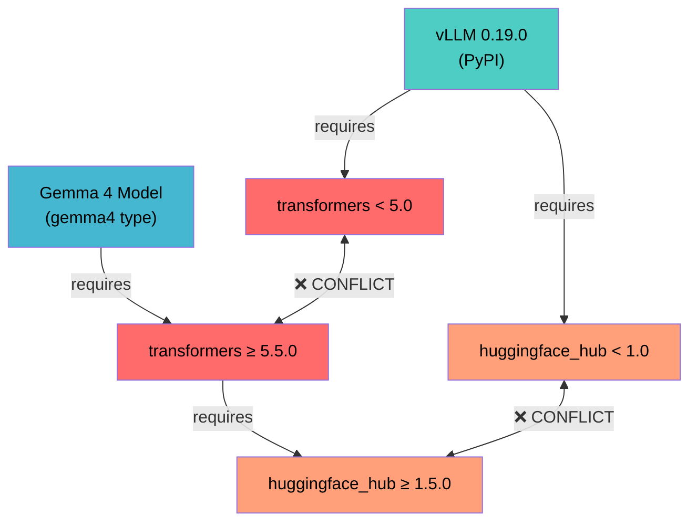

# The Unsolvable Dependency Triangle

> **Author:** Daniel Manzela | **Date:** April 2026

## The Problem

Deploying Gemma 4 27B-A4B-it with vLLM requires three packages that have **mutually exclusive version requirements**. No combination of packages available on PyPI can satisfy all three constraints simultaneously.

## The Constraint Matrix

```
┌──────────────────────────────────────────────────────────────────┐
│                    DEPENDENCY TRIANGLE                           │
│                                                                  │
│   vLLM 0.19.0 (latest PyPI)                                    │
│   ├── requires: transformers < 5.0                              │
│   └── requires: huggingface_hub >= 0.34.0, < 1.0               │
│                                                                  │
│   transformers 5.5.0 (needed for gemma4 model type)             │
│   └── requires: huggingface_hub >= 1.5.0, < 2.0                │
│                                                                  │
│   Gemma 4 Model                                                 │
│   └── requires: transformers >= 5.5.0                           │
│       (Gemma4ForConditionalGeneration only exists in 5.x)       │
│                                                                  │
│   ══════════════════════════════════════════════════════         │
│   vLLM needs hub < 1.0    BUT    transformers 5.x needs hub ≥ 1.5│
│              ▲                              ▲                    │
│              └──── MUTUALLY EXCLUSIVE ───────┘                   │
│                                                                  │
│   vLLM needs transformers < 5    BUT    Gemma 4 needs trans ≥ 5 │
│              ▲                              ▲                    │
│              └──── MUTUALLY EXCLUSIVE ───────┘                   │
└──────────────────────────────────────────────────────────────────┘
```

## Visual Diagram



## Proof by Exhaustion

We tested every feasible combination during Cycle 2:

| Attempt | vLLM | transformers | huggingface_hub | Result |
|---|---|---|---|---|
| 1 | 0.19.0 (PyPI) | 4.57.6 (auto) | 0.35.3 (auto) | ❌ `model type 'gemma4' not recognized` |
| 2 | 0.19.0 (PyPI) | 5.5.0 (pip) | 1.8.0 (conflict) | ❌ pip resolver rejects — `hub<1.0` vs `hub>=1.5` |
| 3 | 0.19.0 (PyPI) | 5.6.0.dev0 (git, --no-deps) | 0.35.3 (from vLLM) | ❌ `is_offline_mode` import error (moved in hub 0.36+) |
| 4 | 0.19.0 (PyPI) | 5.6.0.dev0 (git, --no-deps) | 0.36.2 (force) | ❌ vLLM internal imports break with hub 0.36+ |
| 5 | 0.17.2rc1 (base) | 5.5.0.dev0 (base) | 1.8.0 (base) | ✅ **ONLY WORKING CONFIG** |

## The `is_offline_mode` Import Chain

The most deceptive error — it appears to come from vLLM but actually originates from transformers:

```
Traceback (most recent call last):
  File "vllm/transformers_utils/config.py", line 18
    from transformers import AutoConfig
  File "transformers/__init__.py"
    from .hub import ...
  File "transformers/hub.py"
    from huggingface_hub import is_offline_mode    ← FAILS HERE
ImportError: cannot import name 'is_offline_mode' from 'huggingface_hub'
```

**Explanation:** In `huggingface_hub 0.36+`, `is_offline_mode` was moved from the top-level module to `huggingface_hub.utils`. When `transformers 5.6.0.dev0` (which expects hub ≥ 0.36) is installed with `--no-deps` alongside vLLM 0.19.0's `huggingface_hub 0.35.3` (old location), the import fails.

## Why The Base Image Works

Google's `pytorch-vllm-serve:gemma4` base image ships a **custom** stack that doesn't exist on PyPI:

| Package | Base Image Version | PyPI Latest | Key Difference |
|---|---|---|---|
| vLLM | 0.17.2rc1.dev133 | 0.19.0 | Custom build with `gemma4` model type registered |
| transformers | 5.5.0.dev0 | 5.5.0 (but incompatible hub requirements) | Pre-release with `Gemma4ForConditionalGeneration` |
| huggingface_hub | 1.8.0 | 1.8.0 | Same version, but vLLM's imports are patched to work with it |

The base image's vLLM has been specifically patched by Google to work with `huggingface_hub 1.8.0` and `transformers 5.5.0.dev0`. This patching is NOT available via PyPI.

## Implications

1. **You CANNOT upgrade any of these three packages** without breaking the stack
2. **You CANNOT build a working Gemma 4 deployment from scratch using only PyPI**
3. **The ONLY path to LoRA/quantization support** is either:
   - Google releases an updated `pytorch-vllm-serve:gemma4` image
   - The vLLM team modifies version requirements to support `transformers >= 5.5` and `hub >= 1.5`
   - Someone creates a custom vLLM fork with the necessary patches

## Call to Action

### For vLLM Maintainers
- Consider relaxing `transformers<5` constraint to support Gemma 4
- Consider relaxing `huggingface_hub<1.0` constraint
- Alternatively, backport `gemma4` model type to transformers 4.x compatible code

### For Hugging Face Maintainers
- Ensure `gemma4` model type is available in a `transformers` version compatible with vLLM's constraints
- Consider maintaining backward compatibility for `is_offline_mode` import location

### For Google Cloud
- Document the custom dependency stack in the base image
- Publish the patches applied to vLLM to enable community builds
- Release updated base images when new vLLM versions support Gemma 4 natively

---

*Research and documentation by [Daniel Manzela](https://github.com/Manzela). April 2026.*
